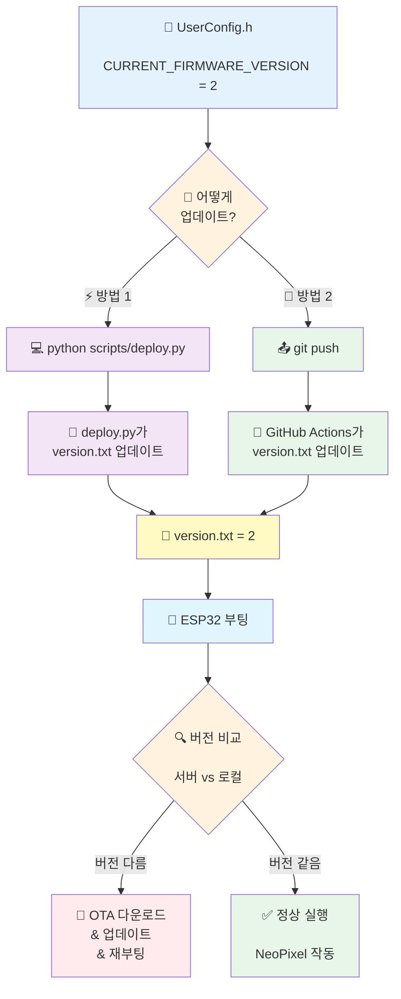

# 🚀 ESP32 OTA Update Template

**버전 관리 기능이 있는 ESP32 OTA 업데이트 템플릿**

GitHub에서 펌웨어를 관리하고 ESP32 기기를 무선으로 업데이트하세요.

[](https://github.com/Fuzzyline-HAS2/OTA_update_template)

> **⭐ 이 프로젝트는 템플릿입니다!**  
> `NeoPixel.ino`는 **예시 모듈**일 뿐입니다. 자신의 프로젝트에 맞게 **자유롭게 수정하거나 삭제**하세요!

---

## ✨ 주요 기능

- ✅ **자동 OTA 업데이트** - GitHub에서 새 버전 자동 감지 및 다운로드
- ✅ **버전 관리** - 업그레이드/다운그레이드 모두 지원
- ✅ **모듈형 구조** - 새 기능 추가가 쉬운 확장 가능한 구조
- ✅ **예시 포함** - NeoPixel 제어 예제 (삭제 가능)
- ✅ **안전 장치** - OTA 실패 시 자동 롤백, 재부팅 방지

---

## 📋 필수 준비물

### 하드웨어
- **ESP32 Dev Module** 또는 **ESP32-S3**
- NeoPixel LED (선택사항)
- 로터리 엔코더 (선택사항)

### 소프트웨어
- [Arduino IDE](https://www.arduino.cc/en/software) 또는 VS Code + Arduino Extension
- [Python 3.x](https://www.python.org/downloads/)
- Git

---

## 🎯 빠른 시작 (5분 완성)

### 1️⃣ 저장소 복사

**방법 A: Template 사용 (권장)**
1. GitHub에서 **"Use this template"** 버튼 클릭
2. 새 저장소 이름 입력 (예: `my-esp32-project`)
3. **Public**으로 설정 (중요!)
4. 생성된 저장소를 로컬에 clone

```bash
git clone https://github.com/YOUR_USERNAME/my-esp32-project.git
cd my-esp32-project
```

**방법 B: 직접 Clone**
```bash
git clone https://github.com/Fuzzyline-HAS2/updated_neopixel_hyo.git
cd updated_neopixel_hyo
```

### 2️⃣ WiFi 설정

`SignedOTA/UserConfig.h` 파일을 열고 수정:

```cpp
// 1. 와이파이 설정
const char *ssid = "내_WiFi_이름";
const char *password = "WiFi_비밀번호";

// 2. 펌웨어 다운로드 주소 (GitHub 저장소 경로)
const char *firmware_url = "https://raw.githubusercontent.com/YOUR_USERNAME/YOUR_REPO/main/update.bin";

// 버전 정보 URL
const char *version_url = "https://raw.githubusercontent.com/YOUR_USERNAME/YOUR_REPO/main/version.txt";
```

> **중요:** `YOUR_USERNAME`과 `YOUR_REPO`를 실제 값으로 변경하세요!

### 3️⃣ 첫 업로드 (USB)

1. Arduino IDE에서 `SignedOTA/Main.ino` 열기
2. **Tools** 설정:
   - Board: `ESP32 Dev Module` 또는 `ESP32S3 Dev Module`
   - Partition Scheme: `Minimal SPIFFS (1.9MB APP with OTA/190KB SPIFFS)`
   - Upload Speed: `115200`
3. **Upload** (Ctrl+U)

### 4️⃣ 동작 확인

Serial Monitor (115200 baud) 확인:

```
ESP32 모듈형 시스템 시작
====================================

[OTA 모듈] 와이파이 연결 성공!
[OTA 모듈] 서버 버전: 1, 현재 버전: 1
[OTA 모듈] ✅ 최신 버전 사용 중 (v1)
[NeoPixel 모듈] 초기화 완료
```

---

## 🔄 OTA 업데이트 방법

### 📊 시스템 작동 방식

**핵심:** `UserConfig.h`의 버전 번호를 변경하면 → `version.txt`가 자동 동기화 → ESP32가 감지!



---

### 방법 1: 자동 배포 (deploy.py) ⚡

**완전 자동화된 방법**

```bash
python scripts/deploy.py
```

**실행 순서:**
1. ✅ 버전 자동 증가 (2 → 3)
2. ✅ "컴파일 하세요" 메시지 → Arduino IDE에서 **Verify** 클릭
3. ✅ Enter 키 입력
4. ✅ `version.txt` 업데이트 (3)
5. ✅ `update.bin` 복사
6. ✅ 자동으로 GitHub에 업로드

---

### 방법 2: 수동 배포 (Git Push) 🚀

**코드만 수정하고 바로 push**

1. **`UserConfig.h` 수정**
   ```cpp
   #define CURRENT_FIRMWARE_VERSION 3  // 2 → 3으로 변경
   ```

2. **Arduino IDE에서 컴파일**
   - `Main.ino` 파일 열기
   - **Sketch → Export Compiled Binary** (Ctrl+Alt+S)
   - 컴파일 완료 대기

3. **생성된 .bin 파일을 `update.bin`으로 복사**
   
   **Windows PowerShell:**
   ```powershell
   # build 폴더에서 가장 최신 .bin 파일 찾기
   $binFile = Get-ChildItem -Path "SignedOTA\build" -Recurse -Filter "*.bin" | 
              Where-Object { $_.Name -notmatch "merged|bootloader|partitions|boot_app" } | 
              Sort-Object LastWriteTime -Descending | 
              Select-Object -First 1
   
   # update.bin으로 복사
   Copy-Item $binFile.FullName -Destination "update.bin"
   ```
   
   **또는 수동으로:**
   - `SignedOTA/build/esp32.esp32.esp32s3/` 폴더 열기
   - `Main.ino.bin` 파일을 프로젝트 루트로 복사
   - 이름을 `update.bin`으로 변경

4. **Git에 추가 및 Push**
   ```bash
   git add SignedOTA/UserConfig.h update.bin
   git commit -m "Update to v3"
   git push
   ```

5. **GitHub Actions 자동 실행** 🤖
   - `UserConfig.h`에서 버전 3 감지
   - `version.txt`를 자동으로 3으로 업데이트
   - ESP32가 새 버전 감지!

> **💡 팁:** 복잡하다면 그냥 `python scripts/deploy.py` 사용하세요!

---

### ESP32 자동 업데이트 프로세스
1. 부팅 시 서버 버전 확인
2. 새 버전 감지 → 다운로드
3. 업데이트 완료 → 재부팅

---

## 📂 프로젝트 구조

```
updated_neopixel_hyo/
├── SignedOTA/
│   ├── Main.ino              # 메인 진입점 (setup/loop)
│   ├── SignedOTA.ino          # OTA 업데이트 모듈
│   ├── NeoPixel.ino           # 네오픽셀 제어 모듈
│   ├── UserConfig.h           # WiFi 및 URL 설정
│   └── public_key.h           # OTA 서명 키
├── scripts/
│   └── deploy.py              # 자동 배포 스크립트
├── version.txt                # 서버 버전 번호
└── update.bin                 # OTA 펌웨어 파일
```

---

## 🔧 예시 모듈 교체하기 (중요!)

**`NeoPixel.ino`는 단순한 예시입니다!** 자신의 프로젝트로 교체하세요.

### 방법 1: NeoPixel 모듈 삭제하고 새로 만들기

1. **`SignedOTA/NeoPixel.ino` 파일 삭제**
2. **자신의 모듈 파일 생성** (예: `MyProject.ino`)
   ```cpp
   void initMyProject() {
     Serial.println("[MyProject] 초기화 시작...");
     // 센서, 액추에이터 등 초기화
     Serial.println("[MyProject] 초기화 완료\\n");
   }

   void updateMyProject() {
     // 반복 실행할 로직
     // 센서 읽기, 데이터 전송 등
   }
   ```
3. **`Main.ino` 수정**
   ```cpp
   void setup() {
     // ...
     initOTA();
     initMyProject();  // ← NeoPixel 대신 자신의 모듈
   }

   void loop() {
     updateMyProject();  // ← NeoPixel 대신 자신의 모듈
   }
   ```

### 방법 2: NeoPixel 모듈 수정해서 사용

`NeoPixel.ino` 파일을 열어서 내용을 자신의 코드로 교체하세요.  
파일 이름은 그대로 두고 내용만 바꿔도 됩니다!

---

## 🔧 새 모듈 추가하기

### 1. 새 파일 생성: `SignedOTA/NewModule.ino`

```cpp
void initNewModule() {
  Serial.println("[NewModule] 초기화 시작...");
  // 초기화 코드
  Serial.println("[NewModule] 초기화 완료\\n");
}

void updateNewModule() {
  // 반복 실행할 코드
}
```

### 2. Main.ino에 추가

```cpp
void setup() {
  Serial.begin(115200);
  delay(2000);
  
  initOTA();
  initNeoPixel();
  initNewModule();     // ← 추가!
}

void loop() {
  updateNeoPixel();
  updateNewModule();   // ← 추가!
}
```

**끝!** 모듈이 자동으로 통합됩니다.

---

## 🛡️ 안전 기능

### 자동 안전장치 6단계

1. ✅ HTTP 200 OK 검증
2. ✅ 파일 크기 검증
3. ✅ 다운로드 완전성 확인
4. ✅ Update 실패 시 자동 롤백
5. ✅ 모든 검증 통과 시에만 재부팅
6. ✅ 에러 시 안전하게 중단

### 버전 체크 시스템

- **같은 버전** → OTA 스킵, 정상 부팅
- **새 버전** → 자동 다운로드 및 업데이트
- **에러** → 안전하게 스킵, 재부팅 안함

---

## 🎨 네오픽셀 핀 변경

`SignedOTA/NeoPixel.ino`:

```cpp
#define NEOPIXEL_PIN 18  // 원하는 GPIO 번호로 변경
```

**ESP32-S3 권장 핀:** 8, 18, 16, 17

---

## ❓ 문제 해결

### Q1. "404 Not Found" 에러

**원인:** GitHub 저장소가 Private

**해결:** Settings → Change repository visibility → **Make public**

### Q2. OTA 다운로드가 느려요 (1분 이상)

**정상입니다!** 1MB 파일을 WiFi로 다운로드하는데 1~2분 소요됩니다.

### Q3. "connection refused" 에러

**해결:** 
- WiFi 연결 확인
- GitHub URL 정확한지 확인
- 리포지토리가 Public인지 확인

### Q4. 매번 같은 펌웨어를 다운로드해요

**해결:** `version.txt`와 `UserConfig.h`의 버전 번호를 확인하세요.

---

## 📚 더 알아보기

- [상세 사용 가이드](docs/USER_GUIDE.md)
- [ESP32 Arduino Core](https://github.com/espressif/arduino-esp32)

---

## 💡 주요 팁

1. **리포지토리는 반드시 Public으로!**
2. **Partition Scheme은 "Minimal SPIFFS with OTA" 사용**
3. **첫 업로드는 USB, 이후는 OTA**
4. **`deploy.py` 스크립트 활용하면 편리함**

---

## 📄 라이선스

MIT License

---

**만든이:** Fuzzyline-HAS2  
**템플릿 버전:** 1.0  
**최종 업데이트:** 2026-02-04
